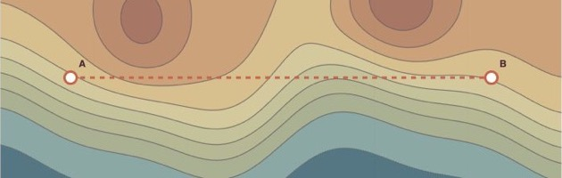
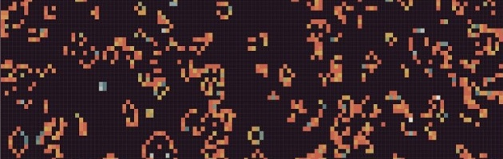

# demo.bokeh.org

This repository powers the Bokeh example gallery. It contains a static landing
page and Python applications served through Bokeh's ASGI adapter. The examples
are grouped by use case and domain, and the catalog records how each one runs.

## Preview

<table>
  <tr>
    <td width="50%">
      
      <br><strong>Terrain contour explorer</strong>: linked contours, a movable transect, and an elevation profile.
    </td>
    <td width="50%">
      
      <br><strong>Streaming market simulator</strong>: intraday OHLC data, volume, drawdown, and MACD.
    </td>
  </tr>
  <tr>
    <td width="50%">
      
      <br><strong>Cellular automata simulator</strong>: editable rules, live pattern comparison, and automatic classification.
    </td>
    <td width="50%">
      
      <br><strong>Hubble image processing</strong>: an editable crop linked to several image-processing pipelines.
    </td>
  </tr>
</table>

## What lives here

- `catalog.py` is the source of truth for routes and gallery metadata.
- `apps/` contains self-contained applications using public datasets or clearly
  labeled computed data.
- `site/` contains the shared visual system, landing-page template, Bokeh
  document template, and deployed error page.
- `asgi.py` serves the landing page, assets, health endpoint, and Bokeh routes.
- `deploy/ecs-task-definition.json` is the application-owned deployment
  template.

The explicit runtime metadata leaves room for BokehJS framework examples and
Pyodide or PyScript examples without putting them through the Python server
application lifecycle.

Most examples combine several Bokeh features around a practical problem. The
vehicle demo recomputes a linked histogram from the current selection. The
market simulator connects a seeded, unlimited OHLC stream to volume and MACD.
The oscillator demo combines MathText and streaming with three views of the
same simulation. The terrain demo links filled contours to a transect that can
be moved and rotated.

Other applications map regional airport access over CARTO tiles, use NetworkX
for graph analysis, and combine Xarray, Numba, and scikit-image for image
processing. Public inputs come with the installed libraries. Computed examples
say when their data is synthetic. The container needs no external data service
at runtime, although the browser fetches basemap tiles for the airport map.

Gallery previews are crops of Bokeh output from the corresponding application.
The Hubble preview and application both use the public-domain NASA/STScI Hubble
Deep Field image.

The palette and footer match the Bokeh marketing site. Layouts vary with the
example, and toolbars appear only where navigation or selection is useful.

## Runtime shape

Each container runs one Uvicorn worker and one `BokehASGI` instance. Because
Bokeh session state is local to the process, ECS tasks provide horizontal
concurrency. ALB cookie affinity keeps each browser on the same task for the
life of its session.

The production image runs free-threaded Python 3.14 with the GIL disabled. The
deployment workflow builds that image for ARM64 Fargate tasks.

The public endpoints are:

- `/`: generated gallery
- `/404.html`: shared Bokeh 404 page
- `/healthz`: dependency-free health check
- `/assets/*`: shared site CSS
- every route declared in `catalog.DEMOS`

`site/404.html` is an exact copy of the page introduced by
[`bokeh/infra#6`](https://github.com/bokeh/infra/pull/6) and maintained at
`components/error-pages/404/404.html` in that repository. Update it from the
infra source instead of editing the local copy. The ASGI wrapper also returns
this page, with status 404, for missing application routes and assets.

## Run locally

### Docker

The image uses free-threaded Python 3.14, the checked-in uv lockfile, and Bokeh
`3.10.0.dev10`. It loads the matching BokehJS bundles from Bokeh's development
CDN. Change the pin to `3.10.0` when the final release is available.

```sh
docker build --tag bokeh-demo .
docker run --rm --publish 5006:5006 bokeh-demo
```

Open <http://localhost:5006>.

### uv

Install [uv](https://docs.astral.sh/uv/), then run the ASGI server. `uv` creates
and syncs the locked environment automatically:

```sh
uv run --locked uvicorn asgi:application
```

Open `http://127.0.0.1:8000`.

### Development checks

Install the Git hooks once after cloning:

```sh
uv run --locked pre-commit install
```

Run the same hooks across the checkout at any time:

```sh
uv run --locked pre-commit run --all-files
```

## Test

The tests use the complete dependency set pinned in `uv.lock`:

```sh
uv run --locked pytest
```

Pass a test module or node ID to narrow the run:

```sh
uv run --locked pytest tests/test_cellular_automata.py
uv run --locked pytest tests/test_cellular_automata.py::test_cellular_automata_compares_rules_from_the_same_state
```

The CI workflow installs the pinned 3.10 dependency, constructs every Bokeh
document, exercises static ASGI responses, and checks the container build.

## Deploy

The `bokeh/infra` repository owns the AWS resources under
`terraform/stacks/aws-demo`. This repository contains no Terraform.

The production workflow uses GitHub OIDC and immutable ECR images. It runs for
pushes to `main` and may also be started manually:

The workflow cross-builds a Linux ARM64 image, matching the Fargate runtime
platform declared here and in the infrastructure repository.

1. Apply the infra commit **Prepare Fargate demo deployment**.
2. Create and protect the GitHub environment `production`.
3. Run **Publish and deploy** manually with `publish_only` enabled. Record the
   digest written to the job summary.
4. Apply the infra commit **Move demo service to Fargate** with that digest.
5. Run **Publish and deploy** normally and verify every route.
6. Apply the two EC2 cleanup commits from the infra repository separately.

Publish-only mode handles the initial bootstrap by filling the new ECR
repository without updating the EC2 service. A normal deployment renders the
committed task definition with the new digest, registers a revision, updates
the `worker` service, and waits for stability.

To roll back an application release, rerun the workflow at the desired Git
commit. ECR retains the most recent immutable `sha-*` images. Infrastructure
rollback and migration gates are documented in the infra stack README.
